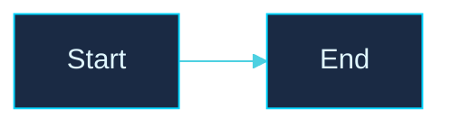

# gitStoneLabs Brand Style

Color and visual reference for the gitStoneLabs documentation and diagrams. Keep this consistent across `INSTALL.md`, `README.md`, and any future visual assets.

---

## Logo

The repo expects the logo at `assets/logo.png` (PNG with transparency preferred; SVG even better). When adding a new logo to a doc:

```markdown
<p align="center">
  
</p>
```

For a banner/hero treatment use width 240–320.

---

## Color palette

Extracted from the gitStoneLabs mascot logo (dark navy + cyan glow).

| Role | Hex | Notes |
|---|---|---|
| **Background — deep** | `#0a1428` | Main backdrop. Like the dark base behind the mascot. |
| **Background — panel** | `#1a2a44` | Card / node fills in diagrams. |
| **Background — elevated** | `#1f3a5f` | Highlighted sections, hover states. |
| **Primary — cyan glow** | `#00d4ff` | The logo's hero color. Use for emphasis, borders, accents. |
| **Primary — soft cyan** | `#4dd0e1` | Edges, dividers, secondary accent. |
| **Primary — pale ice** | `#e0f7ff` | Text on dark backgrounds. |
| **Status — success** | `#3fcf8e` | Green-cyan for "ready" / "OK" states. |
| **Status — warning** | `#ffb84d` | Amber for caution (e.g. the +24 V warning box). |
| **Status — error** | `#ff6b6b` | Soft red for failure / blocked states. |
| **Neutral — pure white** | `#ffffff` | Headings on logo, hero text. |

---

## Mermaid theme directive

Paste this **at the top of every Mermaid diagram** in the repo for visual consistency:

````markdown

````

For dynamic accents inside a diagram, define classDefs:

```
classDef warn fill:#3a2818,stroke:#ffb84d,color:#ffe0a0;
classDef good fill:#16352b,stroke:#3fcf8e,color:#c0f0d8;
classDef err  fill:#3a1a1a,stroke:#ff6b6b,color:#ffd0d0;
classDef opt  fill:#1f3a5f,stroke:#4dd0e1,color:#e0f7ff,stroke-dasharray:5 5;
```

Then apply with `class B1,B2 opt;` after declaring the nodes.

---

## Typography & tone

- **Voice:** matter-of-fact, technical, no marketing fluff. Headings short.
- **Code samples:** always show the exact path or command — never `path/to/file`, always the real one (e.g. `~/klipper/klippy/extras/`).
- **Hardware references:** brand + chipset together on first mention ("CH341 USB-RS485 adapter") then chipset alone after.

---

## Logo modification — outsourced workflow

To rebrand the existing "SinCity Stone" mascot logo to "gitStoneLabs":

1. **Easiest:** open the original in [Photopea](https://www.photopea.com/) (free, browser-based, no install). Use the Text tool over the existing "SinCity Stone" wordmark with the same font family (Bebas Neue or similar bold sans). Export PNG with transparency.
2. **AI-assisted:** drop the original into Midjourney/DALL·E with the prompt *"replace text 'SinCity Stone' with 'gitStoneLabs' keeping identical font, glow effect, and layout"*.
3. **From scratch:** [Canva](https://canva.com) has a "Gaming Mascot" template gallery and a free tier sufficient for this.

Once exported, drop the final PNG at `assets/logo.png` in the repo root and every doc that references it will pick it up automatically.
