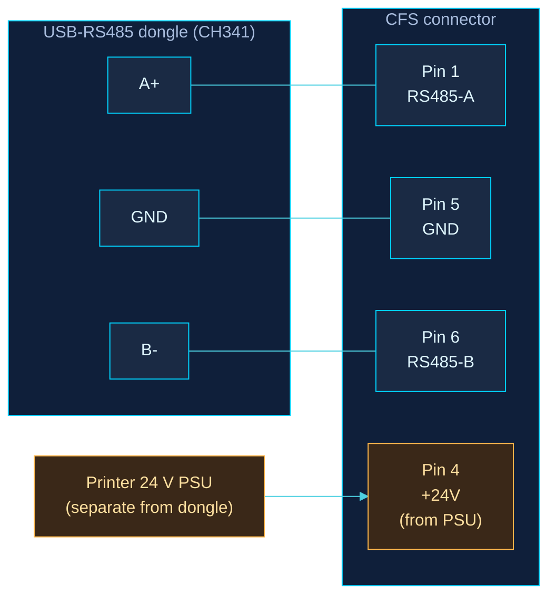
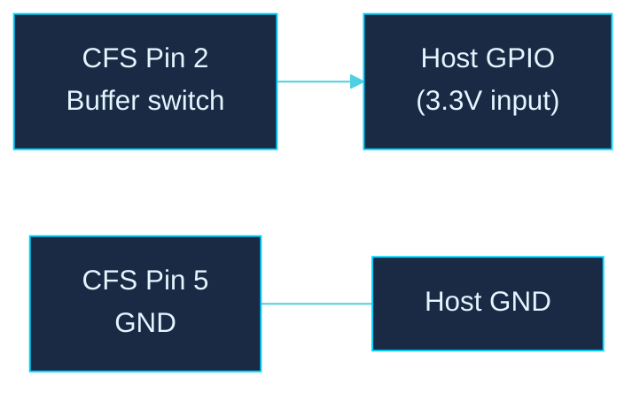
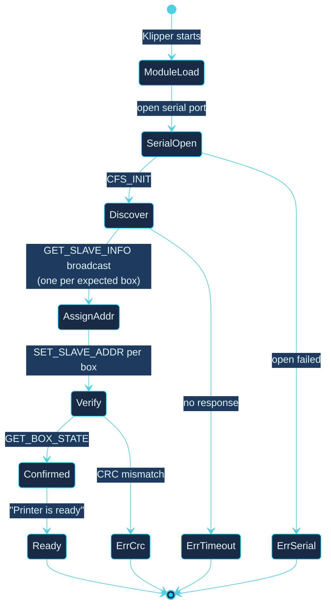
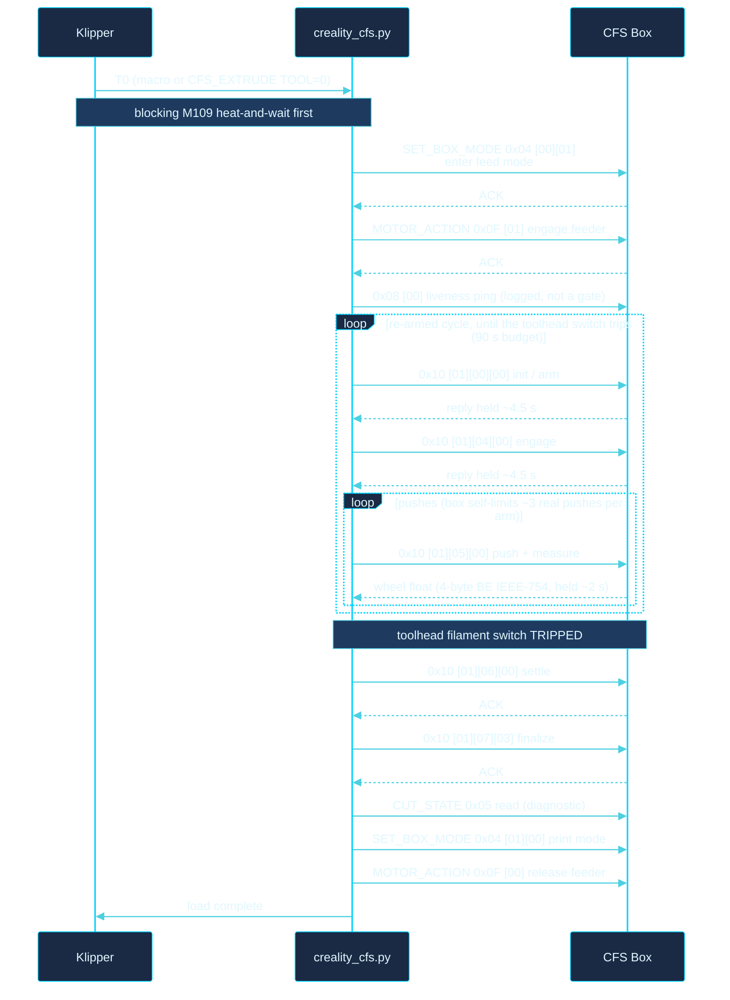

<div align="center">

# Installation Guide

### Creality CFS Klipper Integration

[](https://github.com/gitstonelabs/creality-cfs-klipper)
[](LICENSE)
[](#)

</div>

---

A complete walkthrough for installing the Creality CFS Klipper module on any Klipper-based 3D printer, including non-Creality hardware.

> **TL;DR:** Drop one Python file into Klipper's extras directory, add a 5-line config block, wire a $5 USB-RS485 adapter to the CFS connector, run `CFS_INIT`. Total time: ~15 minutes.

---

## Contents

1. [System overview](#system-overview)
2. [Hardware you need](#hardware-you-need)
3. [Wiring](#wiring)
4. [Software install](#software-install)
5. [First-boot verification](#first-boot-verification)
6. [Daisy-chaining multiple boxes](#daisy-chaining-multiple-boxes)
7. [Troubleshooting](#troubleshooting)
8. [Appendix: Tool-change anatomy](#appendix-tool-change-anatomy)

---

## System overview

Your Klipper host (anything that can run Klipper: Hi mainboard, Raspberry Pi, Jetson, BTT CB1, etc.) talks to the CFS box(es) over a half-duplex RS485 bus at 230400 baud. The module replaces Creality's proprietary `box_wrapper.cpython-39.so` + `serial_485_wrapper.cpython-39.so` binaries entirely.

```mermaid
%%{init: {'theme':'base','themeVariables':{
  'background':'#0a1428','primaryColor':'#1a2a44','primaryTextColor':'#e0f7ff',
  'primaryBorderColor':'#00d4ff','lineColor':'#4dd0e1','secondaryColor':'#1f3a5f',
  'tertiaryColor':'#163056','clusterBkg':'#0f1f3a','clusterBorder':'#00d4ff'}}}%%
flowchart LR
    subgraph Host["Klipper host (Pi / Jetson / printer mainboard)"]
        direction TB
        K[Klipper] --> M["creality_cfs.py<br/>(this module)"]
        M --> S["non-blocking fd transport<br/>(O_NONBLOCK + termios,<br/>reactor.register_fd)"]
    end
    S -->|"/dev/ttyUSB0<br/>or /dev/ttyS5"| A["USB-RS485 adapter<br/>(CH341 confirmed)"]
    A -->|"RS485 A / B / GND<br/>230400 8N1"| B1["CFS Box 1<br/>addr 0x01"]
    B1 -.->|optional daisy chain| B2["CFS Box 2<br/>addr 0x02"]
    B2 -.-> B3["..."]
    B3 -.-> B4["CFS Box 4<br/>addr 0x04"]

    classDef opt fill:#1f3a5f,stroke:#4dd0e1,color:#e0f7ff,stroke-dasharray:5 5;
    class B2,B3,B4 opt;
```



The module needs no pyserial and no pip packages: since v1.3.0 it opens the port itself (`os.open` with `O_NONBLOCK` plus raw 8N1 termios) and registers the fd with Klipper's reactor, so serial waits never block the Klipper event loop. RS485 direction switching is left to an auto-direction adapter by default; kernel RTS-as-DE mode is available via `rts_on_send`.

**Validated on:** Creality Hi (F018) with a CFS v1 box. Transport, CRC, and addressing are capture-validated in this module; the load/unload/cut/flush choreography was hardware-validated on the reference implementation (same wire protocol, same printer), and this module's port of it is wire-faithful but has not yet been exercised on hardware itself.

**K1 / K1C / K2 family: UNTESTED.** The K1-family firmware is a CAN build that remaps several function codes (0x02/0x05/0x08/0x0C), so do not assume the RS485 protocol documented here carries over. Reports from K-series hardware are welcome.

---

## Hardware you need

| Item | Notes |
|---|---|
| Klipper-compatible host | Pi 4/5, Jetson, BTT CB1/CB2, or the printer's own SBC |
| CFS box (at least one) | Stock Creality CFS or CFS-C |
| USB-RS485 adapter **OR** mainboard RS485 port | CH341 chipset confirmed working. FTDI-based dongles also work. |
| 24 V PSU connection | The CFS draws ~24 V on pin 4 of its connector. Use your printer's PSU; the dongle carries data only. |
| 3 jumper wires or a CFS pigtail | A+, B-, GND. ~20 AWG is plenty. |
| *(optional)* GPIO pin on host | For the buffer-empty sensor (filament runout). |

**Approximate cost if you have nothing:** $5 USB-RS485 dongle + connector ≈ $10 total.

---

## Wiring

### The CFS 6-pin connector

Looking at the connector with the latch facing you:

```
            ╭────────────────────────────╮
   Pin 1 ───┤ RS485-A   (red wire)       │
   Pin 2 ───┤ Buffer switch              │ ── optional GPIO
   Pin 3 ───┤ NC                         │
   Pin 4 ───┤ +24 V     (red w/ stripe)  │ ←── from printer PSU, NOT dongle
   Pin 5 ───┤ GND       (green or black) │
   Pin 6 ───┤ RS485-B   (blue wire)      │
            ╰────────────────────────────╯
```

> ⚠ **Pin 4 is +24 V.** Connect it only to your printer's 24 V rail. Never to the USB-RS485 dongle. The dongle is GND + data only.

### USB-RS485 dongle → CFS



| Dongle pin | CFS pin | Function |
|---|---|---|
| A+ | Pin 1 | RS485 data line A |
| B− | Pin 6 | RS485 data line B |
| GND | Pin 5 | Common ground |
| *(none)* | Pin 4 | +24 V from **printer PSU only** |

### Optional: buffer-empty sensor

There is a single filament buffer at the end of the chain. It reports its state with a plain mechanical switch on pin 2 (referenced to pin 5 GND), going to 3.3V when triggered. It is **not** routed over RS485, and a 3-wire USB-RS485 dongle does not break out pin 2, so tap pin 2 and pin 5 off a CFS 6-pin connector and wire them to one 3.3V host GPIO input for buffer or runout detection. One buffer needs one GPIO; you do not need a buffer per box.



In `printer.cfg`:
```ini
[filament_switch_sensor cfs_buffer]
switch_pin: ^EBB:PA2     # any 3.3V GPIO; add ! to invert if it reads backwards
pause_on_runout: false   # we just want logging, not auto-pause
```

### Strongly recommended: toolhead filament sensor

This is a different switch from the buffer sensor above: the filament-runout switch at the **toolhead** that most CFS-capable printers already have. The module uses it to gate the whole load/unload choreography: a load feeds until this switch trips, an unload completes when it clears. Name its `[filament_switch_sensor <name>]` section in the module's `filament_sensor` option (see the config below). Without one, loads run a single ungated feed cycle and cannot confirm the filament actually reached the toolhead.

---

## Software install

### 1. Drop the module into Klipper

```bash
cd ~/klipper/klippy/extras/
wget https://raw.githubusercontent.com/gitstonelabs/creality-cfs-klipper/main/src/creality_cfs.py
```

Or, if you've cloned the repo:
```bash
cp src/creality_cfs.py ~/klipper/klippy/extras/
```

### 2. Drop the macros into your config (optional but recommended)

```bash
cp configs/cfs_macros.cfg ~/printer_data/config/
```

### 3. Edit `printer.cfg`

Minimum block, substitute the serial port for your hardware:

```ini
# USB-RS485 adapter (most common)
[creality_cfs]
serial_port: /dev/serial/by-id/usb-1a86_USB_Single_Serial_*-if00
baud: 230400
box_count: 1

# Optional macros
[include cfs_macros.cfg]
```

For the **Creality Hi onboard RS485** (UART5):
```ini
[creality_cfs]
serial_port: /dev/ttyS5
baud: 230400
box_count: 1
```

Full config with every option exposed (mirrors `configs/printer.cfg.example`):
```ini
[creality_cfs]
serial_port: /dev/ttyUSB0
baud: 230400              # always 230400, non-negotiable for CFS
timeout: 0.1              # short-query command timeout; the load/unload
                          # choreography manages its own longer per-stage timeouts
retry_count: 3            # retries for failed query commands (choreography
                          # stage frames are always single-shot, stock behavior)
box_count: 1              # CFS CONTROLLERS in the daisy chain (1-4), NOT slots;
                          # one 4-slot CFS = box_count: 1
auto_init: True           # run CFS_INIT automatically on klippy:ready

filament_sensor: filament_sensor
#   Name of the TOOLHEAD [filament_switch_sensor <name>] section. This switch
#   gates the load (feed until it trips) and the unload (done when it clears).
#   STRONGLY recommended: without one, loads run a single ungated cycle and
#   cannot confirm the filament arrived.

extrude_temp: 220
#   Default melt temperature for loads/unloads/flushes/cuts. Every filament
#   move blocks on M109 to this first (170 C floor). Override per-material
#   with TEMP= on CFS_EXTRUDE/CFS_RETRUDE/CFS_FLUSH/CFS_CUT.

#load_max_bursts: 5       # per-arm 0x05 push cap during a load (the box
                          # self-limits to ~3 real pushes per arm; the loop
                          # re-arms automatically)
#load_wall_budget: 90     # wall-clock ceiling (s) for the whole sensor-gated load

# Filament cutter (required for CFS_CUT; leave unset if you have no cutter)
#cut_switch_pin: !toolhead_mcu:PB1   # cutter microswitch/hall pin; CFS_CUT
                                     # REFUSES to run without it
#pre_cut_pos_x: 240
#pre_cut_pos_y: 130
#cut_pos_x: 283.5
#cut_pos_x_max: 285       # travel bound on the ram target
#cut_velocity: 3000

# Flush (CFS_FLUSH) tuning
#nozzle_volume: 183       # melt-zone volume (mm^3); flush base = nozzle_volume / 2.4
#flush_multiplier: 1.0    # scales the slicer VOLUME= contribution
#flush_cycle_cap: 80      # per-cycle purge cap (mm)
#flush_default_len: 140   # total purge fallback when no LEN=/VOLUME= given
#flush_velocity: 360
#nozzle_clean_macro: WIPE_NOZZLE   # optional [gcode_macro] run once per flush cycle
```

> 💡 **Prefer `by-id` paths over `/dev/ttyUSB0`** when using USB adapters. `ttyUSB0` can shift when you plug in other USB devices. `ls /dev/serial/by-id/` to find your adapter's stable path.

> 🌡 **Heat-and-wait is by design.** Mainline Klipper keeps the `min_extrude_temp` protection that Creality's fork deletes, and the box-motor feed bypasses Klipper's cold-extrude protection entirely. So every `CFS_EXTRUDE` / `CFS_RETRUDE` / `CFS_FLUSH` / `CFS_CUT` first runs a blocking `M109` to `extrude_temp` (or `TEMP=`) and enforces a 170 C floor. A load that appears to "hang" right after you issue it is usually just the hotend heating.

### 4. Restart Klipper

```bash
sudo systemctl restart klipper
```

---

## First-boot verification

The boot-up sequence the module runs:



Run these from the Klipper console (Mainsail, Fluidd, or Moonraker terminal) **in order**:

### Step 1: Module loaded

`grep creality_cfs /var/log/klipper/klippy.log` should show:
```
creality_cfs: module loaded, port=/dev/ttyUSB0 baud=230400
```

If this line is absent, jump to [troubleshooting](#troubleshooting).

### Step 2: Auto-addressing

```
CFS_INIT
```

Expected (for `box_count=4`):
```
CFS auto-addressing complete: 4/4 box(es) online
```

`0/N online` → check wiring polarity, baud rate, and PSU power.

> ⏱ **Init takes a while by design.** After address assignment the box's slave MCU needs ~9.5 s to wake, so the module probes it with a single 12 s shot (plus bounded retries) before running the connect-init burst; the all-slot presence read alone takes ~11 s. A quiet console for 20-30 s during `CFS_INIT` is normal, not a hang.

### Step 3: Firmware versions

```
CFS_VERSION
```

Each box returns its serial + firmware string:
```
Box 1 (0x01): 1101000084321 5B625AHSC
```

### Step 4: Live state

```
CFS_STATUS
```

```
Box 1 (0x01): FEEDING raw=1a200000
```

`LOADED` means the box is print-locked to a slot; `FEEDING` means it is in feed/change mode. A `[busy/cal active]` suffix means the box is mid-calibration or mid-retract (normal transiently); `[insert event]` means a spool was just inserted. The raw hex is the 4-byte `GET_BOX_STATE` word; see [state decode](#box-state-decode-from-cfs_status) below for what the bytes mean.

### Step 5: Test load + retract

Load a spool into slot A (the first slot), then:

```
CFS_EXTRUDE TOOL=0
CFS_RETRUDE TOOL=0
```

`TOOL=` selects the slot (0-3 for A-D); `BOX=` is only needed on multi-controller daisy chains. Both commands first run a blocking `M109` heat-and-wait to `extrude_temp` (default 220 C), so expect the hotend to heat before anything moves. The load then feeds in sensor-gated bursts until the toolhead filament switch trips (~400 mm path on the reference printer); the unload runs the box's start/finish retract pair with one toolhead pull in between, and completes when the switch clears. If the load times out with "filament did not reach the toolhead", check for a jam at the 4-way splitter and confirm `filament_sensor` points at the right switch.

---

## Daisy-chaining multiple boxes

CFS boxes connect in a chain. Each box has an upstream RS485 connector (toward the host) and a downstream one (to the next box).


### Addressing

Addresses are assigned **dynamically** by `CFS_INIT`: no DIP switches, no manual numbering. The protocol does:

1. Host broadcasts `GET_SLAVE_INFO` with sequence index 1.
2. The **physically-closest box** (the one wired to the host) responds.
3. Host assigns it address `0x01` via `SET_SLAVE_ADDR`.
4. Repeat for index 2, 3, 4, each box farther down the chain.
5. Boxes already addressed stay silent during subsequent rounds.

Re-run `CFS_INIT` any time you change the chain order or hot-swap a box.

### Bus terminator

Most USB-RS485 adapters provide their own A/B bias and termination, so you usually do not need to add a resistor. The common Waveshare USB-RS485 is just A, B, and GND and handles this itself. Some Pi and Jetson RS485 HATs have a 120 Ω jumper, but on those it is often for the CAN side, so check the board before enabling it. If the bus is flaky on a long chain (more than ~2 m), add a 120 Ω resistor across A/B at the far end, after the last box. Short or single-box chains generally do not need one.

---

## Troubleshooting

Quick decision tree:

```mermaid
%%{init: {'theme':'base','themeVariables':{
  'background':'#0a1428','primaryColor':'#1a2a44','primaryTextColor':'#e0f7ff',
  'primaryBorderColor':'#00d4ff','lineColor':'#4dd0e1','secondaryColor':'#1f3a5f'}}}%%
flowchart TD
    Start[Issue:] --> Q1{Did<br/>klippy.log show<br/>module loaded?}
    Q1 -->|No| F1[Check creality_cfs.py is in<br/>klipper/klippy/extras/<br/>and printer.cfg has<br/>&#91;creality_cfs&#93;]
    Q1 -->|Yes| Q2{Does<br/>CFS_INIT find<br/>any boxes?}
    Q2 -->|0/N| Q3{Serial port<br/>open OK?}
    Q3 -->|No| F2[ls -la device path<br/>add user to dialout<br/>try a different port]
    Q3 -->|Yes| F3[Check A/B polarity<br/>verify 24V at CFS pin 4<br/>verify GND continuity]
    Q2 -->|partial| F4[Increase timeout to 0.5<br/>run CFS_INIT twice<br/>check long-chain termination]
    Q2 -->|all OK| Q4{CRC errors<br/>in log?}
    Q4 -->|Yes| F5[Verify baud=230400<br/>shorten cable<br/>add 120R terminator]
    Q4 -->|No| F6[Working. Check<br/>CFS_STATUS for box-specific<br/>state codes]

    classDef fix fill:#1f3a5f,stroke:#4dd0e1,color:#e0f7ff;
    classDef ok fill:#16352b,stroke:#3fcf8e,color:#c0f0d8;
    classDef warn fill:#3a2818,stroke:#ffb84d,color:#ffe0a0;
    class F1,F2,F3,F4,F5 fix;
    class F6 ok;
```



### Box state decode (from `CFS_STATUS`)

The `GET_BOX_STATE` (0x0A) reply is 4 data bytes `[b0][b1][b2][b3]`:

| Byte | Meaning | Values |
|---|---|---|
| `b0` `b1` | Opaque firmware base. Drifts per box/firmware (`1a20`, `1b26`, `1c24`, `1d21` all observed on identical hardware). Carries **no** state; never gate on it. | varies |
| `b2` | Substatus | `0x00` = OK |
| `b3` | The real load flag | `0x02` = loaded / print-locked, `0x00` = feed/change mode, `0x04` = busy (during a `0x16` event) |

The frame's STATUS byte doubles as the box's async event channel and is surfaced by `CFS_STATUS`:

| Event | Meaning | Action |
|---|---|---|
| `0x00` | Idle / steady | none |
| `0x30` | Insert/update push (spool inserted) | none |
| `0x16` | Busy / active calibration or retract | wait; only a problem if it never settles |

---

## Appendix: Tool-change anatomy

Internally `CFS_EXTRUDE` and `CFS_RETRUDE` run the full choreography ported from the hardware-validated reference implementation. There is no position streaming and no status polling: the box **holds each stage reply until the mechanical step completes** (init/finalize ~4.5 s, push ~2 s, unload finish ~9.6 s), so the blocking reply itself is the ready signal and per-stage timeouts are sized accordingly (15 s per load stage). Every 0x10/0x11 frame carries the slot as a data-byte bitmask (`T0`-`T3` → `0x01`/`0x02`/`0x04`/`0x08`); the example below uses slot A (`0x01`).

### Load (`CFS_EXTRUDE TOOL=0`)



The load is **sensor-gated**: the 0x05 push repeats, and the 0x06/0x07 finalize only fires after the toolhead filament switch trips, with the whole cycle re-armed (fresh `[slot] 00 00`) until the switch latches. The 0x05 push reply is the cumulative measuring-wheel position as a 4-byte big-endian IEEE-754 float (negative, magnitude grows as filament feeds); a per-push wheel-advance watchdog detects the box's no-op fast-acks and re-arms early.

### Unload (`CFS_RETRUDE TOOL=0`)

`CFS_RETRUDE` is **not** single-shot. It is a START/FINISH command pair, both frames carrying the slot bitmask, with one toolhead pull interleaved:

1. `0x04 [00][01]` enter feed mode, then a `0x08 [00]` material-sensor read.
2. **START** `0x11 [01][00]`; the reply arrives after ~12-14 s of real pulling.
3. One toolhead `G1 E-15 F360` pull (exactly once, values fixed by the reference implementation).
4. `0x08 [01]` connections read, then **FINISH** `0x11 [01][01]`; the ACK is held ~9.6 s while the box reels the filament fully in.
5. Completion is gated on the toolhead filament switch **clearing**, not on any reply status; the 0x11 reply statuses are diagnostic only. Whole unload bounded by a 60 s wall budget.

---

<div align="center">

**Part of the gitStoneLabs open hardware project family.**

[](LICENSE) · [Issues](https://github.com/gitstonelabs/creality-cfs-klipper/issues) · [Discussions](https://github.com/gitstonelabs/creality-cfs-klipper/discussions) · [Contributing](CONTRIBUTING.md)

</div>
