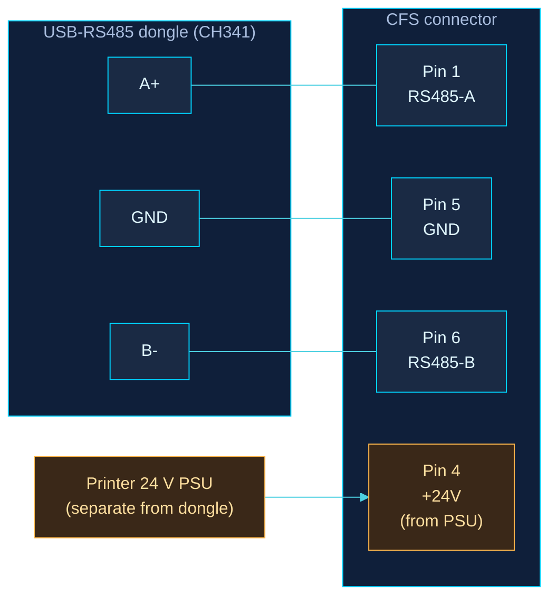
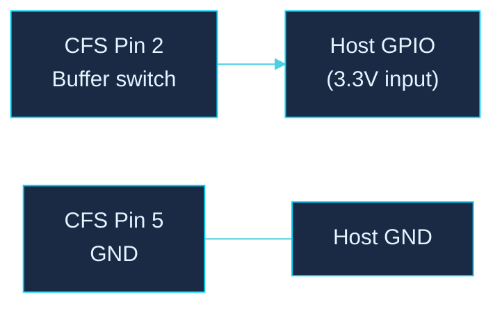
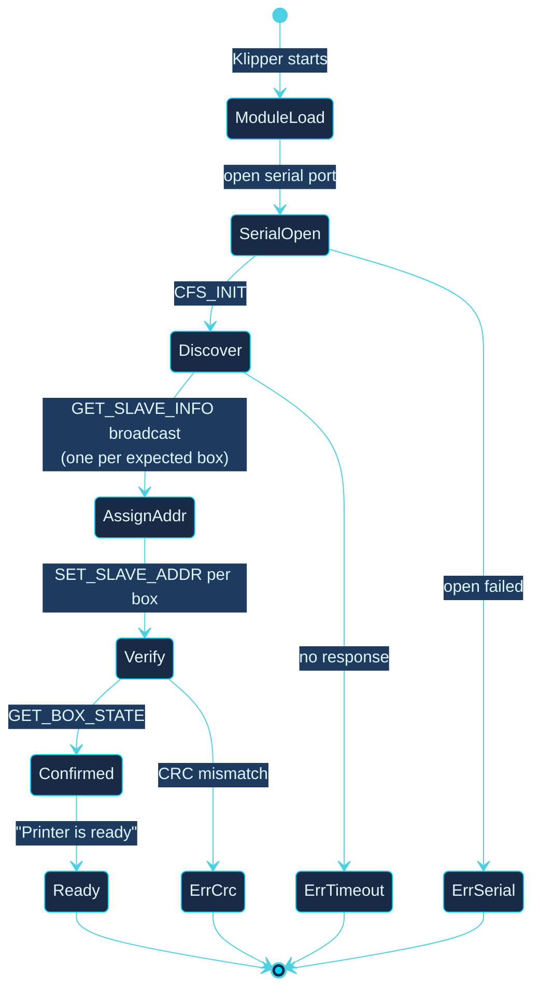
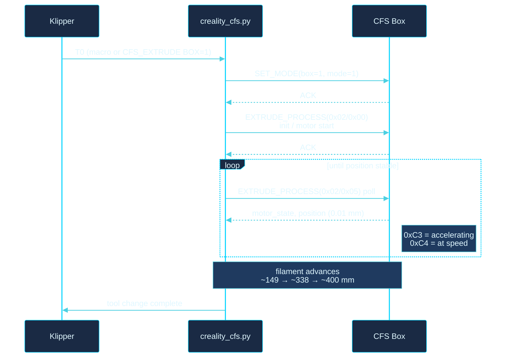

<div align="center">


# Installation Guide

### Creality CFS Klipper Integration

[](https://github.com/gitstonelabs/creality-cfs-klipper)
[](LICENSE)
[](#)

</div>

---

A complete walkthrough for installing the Creality CFS Klipper module on any Klipper-based 3D printer, including non-Creality hardware.

> **TL;DR:** Drop one Python file into Klipper's extras directory, add a 5-line config block, wire a $5 USB-RS485 adapter to the CFS connector, run `CFS_INIT`. Total time: ~15 minutes.

---

## Contents

1. [System overview](#system-overview)
2. [Hardware you need](#hardware-you-need)
3. [Wiring](#wiring)
4. [Software install](#software-install)
5. [First-boot verification](#first-boot-verification)
6. [Daisy-chaining multiple boxes](#daisy-chaining-multiple-boxes)
7. [Troubleshooting](#troubleshooting)
8. [Appendix: Tool-change anatomy](#appendix-tool-change-anatomy)

---

## System overview

Your Klipper host (anything that can run Klipper: Hi mainboard, Raspberry Pi, Jetson, BTT CB1, etc.) talks to the CFS box(es) over a half-duplex RS485 bus at 230400 baud. The module replaces Creality's proprietary `box_wrapper.cpython-39.so` + `serial_485_wrapper.cpython-39.so` binaries entirely.

```mermaid
%%{init: {'theme':'base','themeVariables':{
  'background':'#0a1428','primaryColor':'#1a2a44','primaryTextColor':'#e0f7ff',
  'primaryBorderColor':'#00d4ff','lineColor':'#4dd0e1','secondaryColor':'#1f3a5f',
  'tertiaryColor':'#163056','clusterBkg':'#0f1f3a','clusterBorder':'#00d4ff'}}}%%
flowchart LR
    subgraph Host["Klipper host (Pi / Jetson / printer mainboard)"]
        direction TB
        K[Klipper] --> M["creality_cfs.py<br/>(this module)"]
        M --> S[pyserial]
    end
    S -->|"/dev/ttyUSB0<br/>or /dev/ttyS5"| A["USB-RS485 adapter<br/>(CH341 confirmed)"]
    A -->|"RS485 A / B / GND<br/>230400 8N1"| B1["CFS Box 1<br/>addr 0x01"]
    B1 -.->|optional daisy chain| B2["CFS Box 2<br/>addr 0x02"]
    B2 -.-> B3["..."]
    B3 -.-> B4["CFS Box 4<br/>addr 0x04"]

    classDef opt fill:#1f3a5f,stroke:#4dd0e1,color:#e0f7ff,stroke-dasharray:5 5;
    class B2,B3,B4 opt;
```



**Validated on:** Creality Hi (F018), K1, K1C, K2 Plus, K2 Max. The CFS RS485 protocol is identical across the entire Creality printer family. The same module file works for all of them; only `printer.cfg` differs.

---

## Hardware you need

| Item | Notes |
|---|---|
| Klipper-compatible host | Pi 4/5, Jetson, BTT CB1/CB2, or the printer's own SBC |
| CFS box (at least one) | Stock Creality CFS or CFS-C |
| USB-RS485 adapter **OR** mainboard RS485 port | CH341 chipset confirmed working. FTDI-based dongles also work. |
| 24 V PSU connection | The CFS draws ~24 V on pin 4 of its connector. Use your printer's PSU; the dongle carries data only. |
| 3 jumper wires or a CFS pigtail | A+, B-, GND. ~20 AWG is plenty. |
| *(optional)* GPIO pin on host | For the buffer-empty sensor (filament runout). |

**Approximate cost if you have nothing:** $5 USB-RS485 dongle + connector ≈ $10 total.

---

## Wiring

### The CFS 6-pin connector

Looking at the connector with the latch facing you:

```
            ╭────────────────────────────╮
   Pin 1 ───┤ RS485-A   (red wire)       │
   Pin 2 ───┤ Buffer switch              │ ── optional GPIO
   Pin 3 ───┤ NC                         │
   Pin 4 ───┤ +24 V     (red w/ stripe)  │ ←── from printer PSU, NOT dongle
   Pin 5 ───┤ GND       (green or black) │
   Pin 6 ───┤ RS485-B   (blue wire)      │
            ╰────────────────────────────╯
```

> ⚠ **Pin 4 is +24 V.** Connect it only to your printer's 24 V rail. Never to the USB-RS485 dongle. The dongle is GND + data only.

### USB-RS485 dongle → CFS



| Dongle pin | CFS pin | Function |
|---|---|---|
| A+ | Pin 1 | RS485 data line A |
| B− | Pin 6 | RS485 data line B |
| GND | Pin 5 | Common ground |
| *(none)* | Pin 4 | +24 V from **printer PSU only** |

### Optional: buffer-empty sensor

There is a single filament buffer at the end of the chain. It reports its state with a plain mechanical switch on pin 2 (referenced to pin 5 GND), going to 3.3V when triggered. It is **not** routed over RS485, and a 3-wire USB-RS485 dongle does not break out pin 2, so tap pin 2 and pin 5 off a CFS 6-pin connector and wire them to one 3.3V host GPIO input for buffer or runout detection. One buffer needs one GPIO; you do not need a buffer per box.



In `printer.cfg`:
```ini
[filament_switch_sensor cfs_buffer]
switch_pin: ^EBB:PA2     # any 3.3V GPIO; add ! to invert if it reads backwards
pause_on_runout: false   # we just want logging, not auto-pause
```

---

## Software install

### 1. Drop the module into Klipper

```bash
cd ~/klipper/klippy/extras/
wget https://raw.githubusercontent.com/gitstonelabs/creality-cfs-klipper/main/src/creality_cfs.py
```

Or, if you've cloned the repo:
```bash
cp src/creality_cfs.py ~/klipper/klippy/extras/
```

### 2. Drop the macros into your config (optional but recommended)

```bash
cp configs/cfs_macros.cfg ~/printer_data/config/
```

### 3. Edit `printer.cfg`

Minimum block, substitute the serial port for your hardware:

```ini
# USB-RS485 adapter (most common)
[creality_cfs]
serial_port: /dev/serial/by-id/usb-1a86_USB_Single_Serial_*-if00
baud: 230400
box_count: 1

# Optional macros
[include cfs_macros.cfg]
```

For the **Creality Hi onboard RS485** (UART5):
```ini
[creality_cfs]
serial_port: /dev/ttyS5
baud: 230400
box_count: 1
```

Full config with every option exposed:
```ini
[creality_cfs]
serial_port: /dev/ttyUSB0
baud: 230400      # always 230400, non-negotiable for CFS
timeout: 0.1      # per-byte read timeout
retry_count: 3    # CRC error retries
box_count: 1      # 1-4
auto_init: True   # run CFS_INIT automatically on Klipper start
```

> 💡 **Prefer `by-id` paths over `/dev/ttyUSB0`** when using USB adapters. `ttyUSB0` can shift when you plug in other USB devices. `ls /dev/serial/by-id/` to find your adapter's stable path.

### 4. Restart Klipper

```bash
sudo systemctl restart klipper
```

---

## First-boot verification

The boot-up sequence the module runs:



Run these from the Klipper console (Mainsail, Fluidd, or Moonraker terminal) **in order**:

### Step 1: Module loaded

`grep creality_cfs /var/log/klipper/klippy.log` should show:
```
creality_cfs: module loaded, port=/dev/ttyUSB0 baud=230400
```

If this line is absent, jump to [troubleshooting](#troubleshooting).

### Step 2: Auto-addressing

```
CFS_INIT
```

Expected (for `box_count=4`):
```
CFS auto-addressing complete: 4/4 box(es) online
```

`0/N online` → check wiring polarity, baud rate, and PSU power.

### Step 3: Firmware versions

```
CFS_VERSION
```

Each box returns its serial + firmware string:
```
Box 1 (0x01): 1101000084321 5B625AHSC
```

### Step 4: Live state

```
CFS_STATUS
```

```
Box 1 (0x01): state=0x1C raw=1c140000
```

`state=0x22` means motor jam. Clear the box and re-run `CFS_INIT`.

### Step 5: Test load + retract

```
CFS_EXTRUDE BOX=1
CFS_RETRUDE BOX=1
```

Filament should advance ~400 mm then reverse. If position reports stall around 149 mm or 338 mm, the drive gear is slipping or the filament is jammed.

---

## Daisy-chaining multiple boxes

CFS boxes connect in a chain. Each box has an upstream RS485 connector (toward the host) and a downstream one (to the next box).


### Addressing

Addresses are assigned **dynamically** by `CFS_INIT`: no DIP switches, no manual numbering. The protocol does:

1. Host broadcasts `GET_SLAVE_INFO` with sequence index 1.
2. The **physically-closest box** (the one wired to the host) responds.
3. Host assigns it address `0x01` via `SET_SLAVE_ADDR`.
4. Repeat for index 2, 3, 4, each box farther down the chain.
5. Boxes already addressed stay silent during subsequent rounds.

Re-run `CFS_INIT` any time you change the chain order or hot-swap a box.

### Bus terminator

Most USB-RS485 adapters provide their own A/B bias and termination, so you usually do not need to add a resistor. The common Waveshare USB-RS485 is just A, B, and GND and handles this itself. Some Pi and Jetson RS485 HATs have a 120 Ω jumper, but on those it is often for the CAN side, so check the board before enabling it. If the bus is flaky on a long chain (more than ~2 m), add a 120 Ω resistor across A/B at the far end, after the last box. Short or single-box chains generally do not need one.

---

## Troubleshooting

Quick decision tree:

```mermaid
%%{init: {'theme':'base','themeVariables':{
  'background':'#0a1428','primaryColor':'#1a2a44','primaryTextColor':'#e0f7ff',
  'primaryBorderColor':'#00d4ff','lineColor':'#4dd0e1','secondaryColor':'#1f3a5f'}}}%%
flowchart TD
    Start[Issue:] --> Q1{Did<br/>klippy.log show<br/>module loaded?}
    Q1 -->|No| F1[Check creality_cfs.py is in<br/>klipper/klippy/extras/<br/>and printer.cfg has<br/>&#91;creality_cfs&#93;]
    Q1 -->|Yes| Q2{Does<br/>CFS_INIT find<br/>any boxes?}
    Q2 -->|0/N| Q3{Serial port<br/>open OK?}
    Q3 -->|No| F2[ls -la device path<br/>add user to dialout<br/>try a different port]
    Q3 -->|Yes| F3[Check A/B polarity<br/>verify 24V at CFS pin 4<br/>verify GND continuity]
    Q2 -->|partial| F4[Increase timeout to 0.5<br/>run CFS_INIT twice<br/>check long-chain termination]
    Q2 -->|all OK| Q4{CRC errors<br/>in log?}
    Q4 -->|Yes| F5[Verify baud=230400<br/>shorten cable<br/>add 120R terminator]
    Q4 -->|No| F6[Working. Check<br/>CFS_STATUS for box-specific<br/>state codes]

    classDef fix fill:#1f3a5f,stroke:#4dd0e1,color:#e0f7ff;
    classDef ok fill:#16352b,stroke:#3fcf8e,color:#c0f0d8;
    classDef warn fill:#3a2818,stroke:#ffb84d,color:#ffe0a0;
    class F1,F2,F3,F4,F5 fix;
    class F6 ok;
```



### Common state codes (from `CFS_STATUS`)

| Code | Meaning | Action |
|---|---|---|
| `0x1C` | Idle, ready | none |
| `0x14` | Active load/retract | wait |
| `0x22` | Motor jam | clear jam, `CFS_INIT` again |
| `0xFE` | Comm error | check wiring |

---

## Appendix: Tool-change anatomy

Internally `CFS_EXTRUDE` is a multi-step sequence with streaming position feedback. Understanding this helps when something goes wrong mid-change.



`CFS_RETRUDE` is the same shape but with sub-command `0x02/0x01` and is single-shot (no streaming).

---

<div align="center">

**Part of the gitStoneLabs open hardware project family.**

[](LICENSE) · [Issues](https://github.com/gitstonelabs/creality-cfs-klipper/issues) · [Discussions](https://github.com/gitstonelabs/creality-cfs-klipper/discussions) · [Contributing](CONTRIBUTING.md)

</div>
